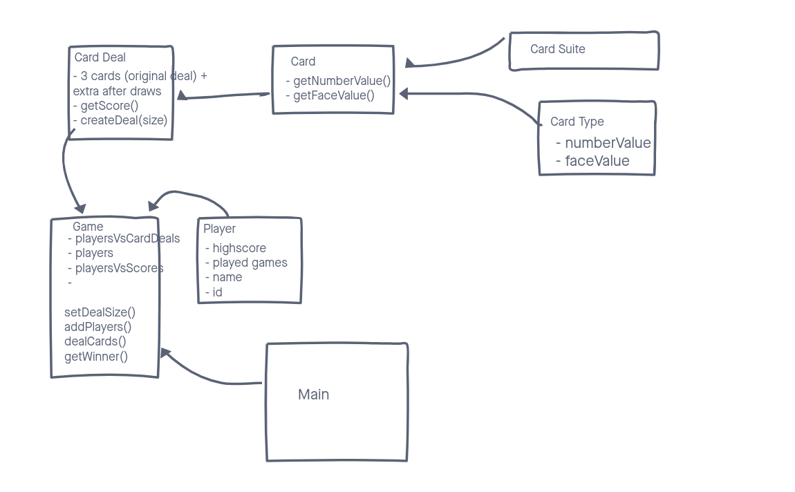

# Card Performance Testing

Solution for below given problem statement.

## How to

#### Build

 - Have gradle installed on system
 - Run `gradle build` to build the jar and run the tests.

#### Run
 - Make sure to run build.
 - Run `java -jar jars/card-game/build/libs/card-game.jar`

## Design

## Problem Statement

The festival season is here and you realise it's hard to play all those complicated card games when you're drunk.
You decide to create a simple luck-based game for people to play when they have limited motor and sensory control.

#### Basic Rules:
 - Use a standard deck of cards (no Joker).
 - Each player is dealt only three cards.
 - 'A' is considered to have a number value of 1.
 - 'A' is considered the top card in a face-off. So the order is A > K > Q > J > 10...2

#### Victory:
 - A trail (three cards of the same number) is the highest possible combination.
 - The next highest is a sequence (numbers in order, e.g., 4,5,6. A is considered to have a value of 1).
 - The next highest is a pair of cards (e.g.: two Kings or two 10s).
     > **Note:** As problem statement does not mentioned it, we are assuming A > K here
 - If all else fails, the top card (by number value wins).
 - If the top card has the same value, each of the tied players draws a single card from the deck until a winner is found.
 - Only the newly drawn cards are compared to decide a tie. The top card wins a tie.
 - For now the suit (spades/hearts etc...), does not matter.

#### TODO:
 1. Simulate a game between 4 players.
 2. Randomly deal them cards from a deck.
 3. Determine the winner.

#### What we're interested to see:
 1. Put your project in a git repo.
 2. Write code that's simple and easy to understand.
 3. We might change some of this, so if you have tests, it will be easier to do so.
 4. Use core libraries (For e.g., for Java: Mockito, junit, logging framework additions are fine)
 5. Don't use a database, Keep it simple for now.
 6. We expect to see your best effort for the code turned in. Think production ready.

